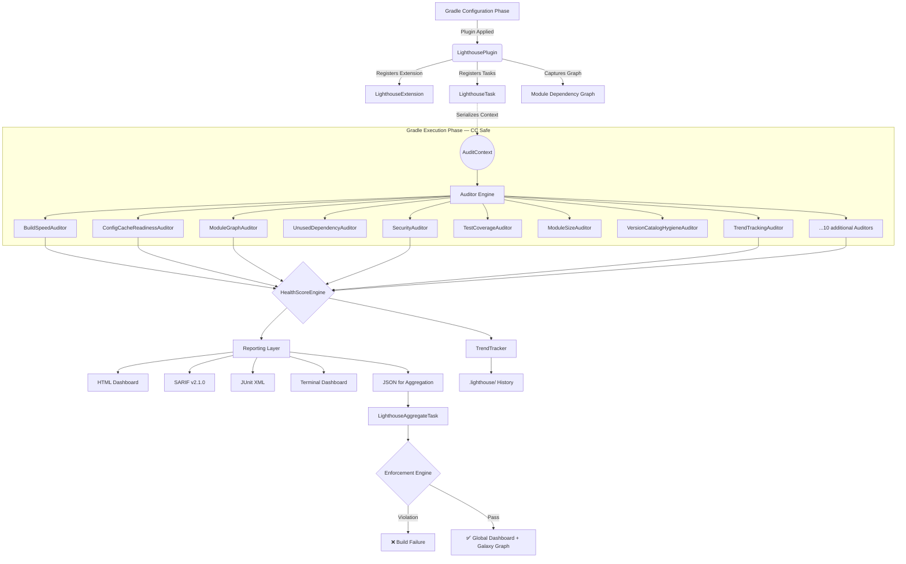
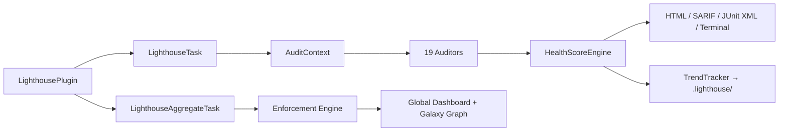

# High-Level Design

> Gradle Lighthouse — v2.2.1 | Plugin ID: `io.github.dev-vikas-soni.lighthouse`

---

## Table of Contents

1. [What this is](#1-what-this-is)
2. [System architecture](#2-system-architecture)
3. [Design decisions](#3-design-decisions)
4. [Execution flow](#4-execution-flow)
5. [Component dependencies](#5-component-dependencies)
6. [Constraints](#6-constraints)

---

## 1. What this is

Gradle Lighthouse is a Gradle plugin that runs structural audits on Android and Kotlin Multiplatform projects at build time. It hooks into the Gradle task graph, captures project state during configuration, and analyses it during execution.

The plugin produces HTML, SARIF, and JUnit XML reports per module, plus an aggregate dashboard with an interactive module graph visualization. Optionally, it fails the build when specific structural violations are detected.

### Goals

| Goal | How |
|------|-----|
| No required configuration | All 19 auditors enabled by convention; plugin works with zero `lighthouse {}` block |
| Configuration Cache safe | All project data captured as serialized `Provider` inputs before task execution |
| Isolated Projects compatible | No cross-project `project()` access at execution time |
| Self-contained reports | HTML fully inlined — no CDN, works in air-gapped environments |
| Enforcement at aggregation | Cycle, layer, and score gates run on the complete graph, not per-module |

---

## 2. System architecture

Two phases, aligned with Gradle's lifecycle. Configuration phase captures data only. Execution phase does all the work.



### 2.1 Core components

| Component | Responsibility |
|-----------|----------------|
| **LighthousePlugin** | Entry point. Registers the `lighthouse {}` DSL extension, creates `lighthouseAudit` and `lighthouseAggregate` tasks, and captures all project state as serialized `Provider` inputs during configuration. |
| **AuditContext** | A `Serializable` data class holding a point-in-time snapshot of the project: dependencies, manifests, Gradle properties, source sets, and the module graph. Has no reference to `org.gradle.api.Project`. |
| **Auditor Engine** | 19 stateless `Auditor` implementations. Each is a pure function `AuditContext → List<AuditIssue>`. Six domains: Performance, Architecture, Dependencies, Security, Quality, Compliance. |
| **HealthScoreEngine** | Exponential decay: `score = 100 × 0.98^(weighted_impact)`. Weights: FATAL=35, ERROR=15, WARNING=5, INFO=1. Returns score, rank, and per-issue deductions. |
| **Reporting Layer** | Self-contained HTML (includes the Galaxy Graph canvas), SARIF v2.1.0, JUnit XML (Surefire format), ANSI terminal dashboard, and a JSON file consumed by aggregation. |
| **TrendTracker** | Appends per-module and global scores, coupling density, and fatal issue counts to `.lighthouse/`. The aggregate dashboard reads these for the velocity charts. |
| **Enforcement Engine** | Evaluates `failOnDependencyCycle`, `failOnLayerViolation`, `minHealthScore`, and custom YAML rules. Runs only during `lighthouseAggregate`. |
| **Galaxy Graph Engine** | Canvas-based module graph renderer. Spring-repulsion layout, orbital layer grouping, cycle highlighting, Sandbox Mode edge cutting, PNG export. |

---

## 3. Design decisions

### 3.1 Configuration Cache compatibility
Plugins that reference `Project` during task execution break when CC is enabled, because Gradle snapshots the task graph and replays inputs without re-evaluating configuration. Our fix: everything is captured during configuration via `Provider` APIs and stored as `@Input` properties. The `@TaskAction` body has no live Gradle API references. Tested with Gradle 8.5–9.5.

### 3.2 Isolated Projects (Gradle 9.x)
Gradle 9.x memory-isolates subprojects, disallowing cross-project `project()` lookups at execution time. Each `LighthouseTask` emits a self-contained JSON file. `LighthouseAggregateTask` declares those files as `@InputFiles`, so it never needs to call `project()` on another subproject.

### 3.3 Self-contained reports
Enterprise networks often block CDNs (jsDelivr, unpkg, Google Fonts). Reports that reference external resources silently break in those environments. All CSS, JS, and the Galaxy Graph canvas engine are inlined. No `<script src="...">` or `<link href="...">` referencing external hosts.

### 3.4 Zero configuration on first run
Plugin adoption falls off when setup requires a block of DSL before anything works. All 19 auditors default to `convention(true)`. Adding `id("io.github.dev-vikas-soni.lighthouse")` is enough; no `lighthouse {}` block is needed.

### 3.5 Custom architecture rules via YAML
Different organizations model their module structure differently. Rather than hardcoding `App → Feature → Core`, the plugin supports `lighthouse-rules.yaml` — a plain YAML file where teams express their own isolation and layering rules. The Enforcement Engine evaluates these rules during aggregation without requiring any Gradle build script changes.

### 3.6 Stateless auditors
Stateful auditors would complicate testing and create thread-safety concerns if we ever parallelize execution. All 19 auditors have no class-level mutable state. Each call is `AuditContext → List<AuditIssue>`. A `try/catch` in `LighthouseTask` wraps each auditor call — one failing auditor logs a warning and is skipped, the rest continue.

---

## 4. Execution flow

```
Step 1   Plugin Applied          LighthousePlugin.apply(project) invoked by Gradle
Step 2   Extension Registered    lighthouse {} DSL block registered on project
Step 3   Graph Captured          Module dependency graph serialized to pipe-delimited strings
Step 4   Task Registered         lighthouseAudit + lighthouseAggregate added to task graph
Step 5   CC Snapshot Frozen      All Provider inputs sealed — Configuration Phase ends
          ─────────────────── Execution Phase ────────────────────────────────────────
Step 6   Task Executes           LighthouseTask.execute() called by Gradle
Step 7   Context Rebuilt         AuditContext reconstructed from serialized @Input properties
Step 8   Auditors Run            Each enabled Auditor.audit(context) called in sequence
Step 9   Score Calculated        HealthScoreEngine computes score, rank, and deductions
Step 10  Terminal Output         ConsoleLogger prints ANSI dashboard (score, delta, next rank)
Step 11  Trend Persisted         Score saved to .lighthouse/{module}-history.json
Step 12  Reports Written         HTML, SARIF, JUnit XML, and JSON written to build/reports/lighthouse/
Step 13  Per-Module Gate         If failOnSeverity set, build fails on threshold breach
          ─────────────────── Aggregation Phase ──────────────────────────────────────
Step 14  Aggregation Runs        LighthouseAggregateTask reads all module JSON output files
Step 15  Global History          Coupling density + global score appended to global-history.json
Step 16  Enforcement Checked     failOnDependencyCycle, failOnLayerViolation, minHealthScore evaluated
Step 17  Custom YAML Rules       lighthouse-rules.yaml constraints evaluated against final graph
Step 18  Global Dashboard        project-dashboard.html with Galaxy Graph + Velocity Analytics emitted
```

---

## 5. Component dependencies



---

## 6. Constraints

| Requirement | Target | Notes |
|-------------|--------|-------|
| Configuration Cache | Compatible | Verified Gradle 8.5–9.5 |
| Isolated Projects | Safe | No cross-project access at execution |
| Minimum Gradle version | 8.5 | |
| JDK | 17+ | |
| Build overhead | < 2s per module | All analysis deferred to execution phase |
| Runtime dependencies | None | Zero transitive classpath additions |
| Air-gap compatibility | Full | All report assets inlined |
| Thread safety | Auditors stateless | Safe for future parallel invocation |

