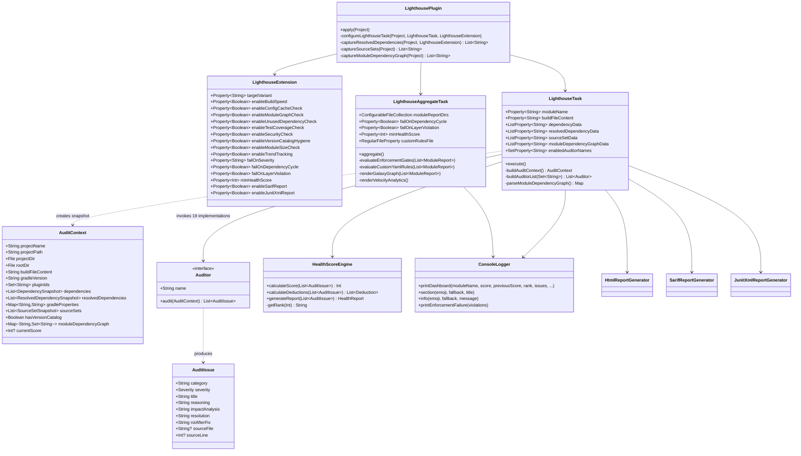

# Low-Level Design

> Implementation reference for contributors. Complements [HLD.md](HLD.md).
> v2.2.0

---

## Table of Contents

1. [Class diagram](#1-class-diagram)
2. [Auditor registry](#2-auditor-registry)
3. [Implementation notes](#3-implementation-notes)
4. [Phase 2 internals](#4-phase-2-internals)
5. [Adding a new auditor](#5-adding-a-new-auditor)
6. [Build and publish](#6-build-and-publish)
7. [File structure](#7-file-structure)

---

## 1. Class diagram



---

## 2. Auditor registry

| # | Class | Registry key (`enabledAuditorNames`) | Domain |
|---|-------|--------------------------------------|--------|
| 1 | `BuildSpeedAuditor` | `BuildSpeed` | Performance |
| 2 | `ConfigCacheReadinessAuditor` | `ConfigCacheReadiness` | Performance |
| 3 | `StartupPerformanceAuditor` | `Modernization` | Performance |
| 4 | `AppSizeAuditor` | `AppSize` | Performance |
| 5 | `ModuleGraphAuditor` | `ModuleGraph` | Architecture |
| 6 | `ModuleSizeAuditor` | `ModuleSize` | Architecture |
| 7 | `UnusedDependencyAuditor` | `UnusedDependency` | Dependencies |
| 8 | `DependencyAuditor` | `DependencyHealth` | Dependencies |
| 9 | `ConflictIntelligenceAuditor` | `ConflictIntelligence` | Dependencies |
| 10 | `CatalogMigrationAuditor` | `CatalogMigration` | Dependencies |
| 11 | `VersionCatalogHygieneAuditor` | `VersionCatalogHygiene` | Dependencies |
| 12 | `SecurityAuditor` | `Security` | Security |
| 13 | `TestCoverageAuditor` | `TestCoverage` | Quality |
| 14 | `ProguardSafetyAuditor` | `Stability` | Quality |
| 15 | `ManifestAuditor` | `Stability` | Quality |
| 16 | `ModernizationAuditor` | `Modernization` | Modernization |
| 17 | `PlayPolicyAuditor` | `PlayStorePolicy` | Compliance |
| 18 | `KmpStructureAuditor` | `KmpStructure` | Compliance |
| 19 | `TrendTrackingAuditor` | `TrendTracking` | Observability |

---

## 3. Implementation notes

### 3.1 The snapshot mechanism (`AuditContext.kt`)

All project data is captured in `LighthousePlugin.kt` during the configuration phase using `Provider` APIs. Nothing live crosses the configuration/execution boundary.

```kotlin
// Dependencies captured as pipe-delimited strings.
// We avoid complex objects because Gradle's CC engine can't serialize live org.gradle.api.* types.
task.dependencyData.set(project.provider {
    project.configurations
        .filter { /* variant matching */ }
        .flatMap { config ->
            config.dependencies.filterIsInstance<ExternalDependency>().map { dep ->
                "${config.name}|${dep.group}|${dep.name}|${dep.version}"
            }
        }
})

// Module graph — all ProjectDependency references captured at configuration time
task.moduleDependencyGraphData.set(project.provider {
    captureModuleDependencyGraph(project)  // "modulePath|dep1,dep2,dep3"
})
```

`AuditContext` reconstructs typed objects from these strings inside `@TaskAction`. The pipe-delimited format is intentional: it avoids Gradle's CC serialization constraints that prevent capturing `org.gradle.api.*` implementations directly.

### 3.2 Auditor interface

All auditors are stateless. The contract is `AuditContext → List<AuditIssue>`.

```kotlin
class MyNewAuditor : Auditor {
    override val name: String = "MyCheck"

    override fun audit(context: AuditContext): List<AuditIssue> {
        val issues = mutableListOf<AuditIssue>()

        if (context.gradleProperties["some.flag"] != "true") {
            issues.add(AuditIssue(
                category = "Performance",
                severity = Severity.ERROR,
                title = "Missing performance flag",
                reasoning = "...",
                impactAnalysis = "...",
                resolution = "...",
                roiAfterFix = "...",
                sourceFile = "gradle.properties"
            ))
        }
        return issues
    }
}
```

Each auditor call in `LighthouseTask` is wrapped in a `try/catch`. A failing auditor logs a warning and is skipped; the others continue.

### 3.3 Terminal dashboard (`ConsoleLogger.kt`)

Printed on every `lighthouseAudit` run using ANSI escape codes and Unicode box-drawing characters:

```
┌──────────────────────────────────────────────────────────┐
│  🏗️  Gradle Lighthouse — Score: 72/100 (+8)              │
│  Rank: Standard → Expert 🎯                              │
├──────────────────────────────────────────────────────────┤
│  ✅ Build caching enabled                                 │
│  ❌ KAPT detected — save 104h/year with KSP               │
│  ⚠️  3 unused dependencies                                │
├──────────────────────────────────────────────────────────┤
│  5 issues: 2 error · 2 warn · 1 info                     │
│  💡 Fix 2 issues to unlock Expert rank                    │
└──────────────────────────────────────────────────────────┘
```

The `+8` delta comes from reading the previous score out of `.lighthouse/{module}-history.json`.

### 3.4 Trend tracking (`TrendTrackingAuditor.kt`)

Scores are appended to `.lighthouse/{module}-history.json`, capped at 30 entries:

```json
[
  {"score": 65, "timestamp": "2026-04-28T10:30:00"},
  {"score": 72, "timestamp": "2026-05-03T14:00:00"},
  {"score": 79, "timestamp": "2026-05-17T09:15:00"}
]
```

`getPreviousScore()` reads the last entry for delta display. Global coupling density and aggregate score go to `.lighthouse/global-history.json`, written by `LighthouseAggregateTask`.

### 3.5 Module graph analysis (`ModuleGraphAuditor.kt`)

- **Cycle detection**: Iterative DFS with a recursion stack, operating on the current module's subgraph view.
- **Feature coupling**: Regex-based check for `project()` dependencies between modules sharing a `:feature:` path segment.
- **Coupling density**: `(total inter-module edges) / (modules × (modules - 1))`
- **DOT output**: Full module graph written to `build/reports/lighthouse/module-graph.dot`.

### 3.6 Reporting engines

| Generator | Format | Primary consumer |
|-----------|--------|-----------------|
| `HtmlReportGenerator` | HTML5 (dark/light mode, responsive, self-contained) | Browser |
| `SarifReportGenerator` | SARIF v2.1.0 | GitHub Security tab, VS Code |
| `JunitXmlReportGenerator` | JUnit XML (Surefire) | Jenkins, GitHub Actions test summary |
| `ConsoleLogger.printDashboard` | ANSI terminal | Developer terminal |
| JSON aggregation output | Machine-readable per-module summary | `LighthouseAggregateTask` |

---

## 4. Phase 2 internals

### 4.1 Galaxy Graph

Rendered as an embedded `<canvas>` in `project-dashboard.html`.

- **Layout**: Modules assigned to orbital rings by layer. Spring-repulsion prevents node overlap.
- **Cycle highlighting**: Edges in cycles (reused from `ModuleGraphAuditor`) are drawn with `ctx.shadowBlur` for a red glow.
- **Sandbox Mode**: Edge state is a JavaScript `Map`. Cutting an edge removes it from the simulation and re-runs cycle detection — no page reload.
- **Export**: Uses `canvas.toDataURL("image/png")`.

### 4.2 Enforcement engine (`LighthouseAggregateTask.kt`)

Evaluated sequentially after all module JSON reports are read:

```
Gate 1: failOnDependencyCycle
    → Re-run DFS on the merged global graph from all module JSONs
    → Collect cycles as List<List<String>>

Gate 2: failOnLayerViolation
    → Classify each module as App/Feature/Core/Data/Domain by path segment
    → Check that all edges go in the permitted direction: App → Feature → Core
    → Collect violations as List<Pair<String, String>>

Gate 3: minHealthScore
    → Compute global weighted average from all module scores
    → Compare against the configured minimum

If any gate fails → print structured diagnostics → throw GradleException
```

### 4.3 Custom YAML rule evaluation

`lighthouse-rules.yaml` is parsed with a bundled minimal YAML parser (no external dependency).

- **Layering rules** (`A -> B -> C`): Parsed as an ordered sequence; edge directions validated against it.
- **Isolation rules** (`:module:* !-> :module:*`): Glob patterns compiled to regex; all graph edges tested against the deny list.

---

## 5. Adding a new auditor

**Step 1** — Create the file:
```
src/main/kotlin/com/gradlelighthouse/auditors/MyNewAuditor.kt
```
Logic must use only `AuditContext` fields. No direct filesystem or network access.

**Step 2** — Register in `LighthouseTask.buildAuditorList()`:
```kotlin
if ("MyNewCheck" in enabled) auditors.add(MyNewAuditor())
```

**Step 3** — Add a toggle to `LighthouseExtension.kt`:
```kotlin
val enableMyNewCheck: Property<Boolean> = objects.property(Boolean::class.java).convention(true)
```

**Step 4** — Wire it in `LighthousePlugin.kt`:
```kotlin
if (ext.enableMyNewCheck.get()) add("MyNewCheck")
```

**Step 5** — If the auditor needs data not yet in `AuditContext`:
1. Add a field to `AuditContext.kt` (must be `Serializable`)
2. Capture it via `Provider` in `LighthousePlugin.kt`
3. Declare a corresponding `@Input` or `@InputFiles` on `LighthouseTask`
4. Reconstruct it in `LighthouseTask.buildAuditContext()`

**Step 6** — Write tests using `GradleRunner` with `@TempDir`. Cover both the "issue found" and "no issue" paths.

**Step 7** — Update docs:
- Auditor registry table in [Section 2](#2-auditor-registry) of this document
- "What it checks" section in `README.md`
- Any new `lighthouse {}` property in [USER_MANUAL.md](USER_MANUAL.md) Section 3

---

## 6. Build and publish

```bash
# Build and run all tests
./gradlew build

# Validate plugin descriptors
./gradlew validatePlugins

# Publish to Maven Local (for local end-to-end testing)
./gradlew publishToMavenLocal

# Publish to Gradle Plugin Portal
export GRADLE_PUBLISH_KEY=<your-key>
export GRADLE_PUBLISH_SECRET=<your-secret>
./gradlew publishPlugins
```

---

## 7. File structure

```
src/main/kotlin/com/gradlelighthouse/
├── LighthousePlugin.kt                   # Entry point, configuration capture, task wiring
├── core/
│   ├── AuditContext.kt                   # Serializable project snapshot
│   ├── Auditor.kt                        # Auditor interface + AuditIssue + Severity enum
│   ├── ConsoleLogger.kt                  # ANSI terminal output
│   └── HealthScoreEngine.kt              # Scoring algorithm + rank table
├── extension/
│   └── LighthouseExtension.kt            # DSL block
├── auditors/
│   ├── BuildSpeedAuditor.kt
│   ├── ConfigCacheReadinessAuditor.kt
│   ├── ModuleGraphAuditor.kt
│   ├── ModuleSizeAuditor.kt
│   ├── UnusedDependencyAuditor.kt
│   ├── DependencyAuditor.kt
│   ├── ConflictIntelligenceAuditor.kt
│   ├── CatalogMigrationAuditor.kt
│   ├── VersionCatalogHygieneAuditor.kt
│   ├── SecurityAuditor.kt
│   ├── TestCoverageAuditor.kt
│   ├── ProguardSafetyAuditor.kt
│   ├── ManifestAuditor.kt
│   ├── ModernizationAuditor.kt
│   ├── StartupPerformanceAuditor.kt
│   ├── AppSizeAuditor.kt
│   ├── PlayPolicyAuditor.kt
│   ├── KmpStructureAuditor.kt
│   └── TrendTrackingAuditor.kt
├── task/
│   ├── LighthouseTask.kt                 # Core per-module audit task
│   └── LighthouseAggregateTask.kt        # Multi-module aggregation and enforcement
└── reporting/
    ├── HtmlReportGenerator.kt
    ├── SarifReportGenerator.kt
    └── JunitXmlReportGenerator.kt
```
